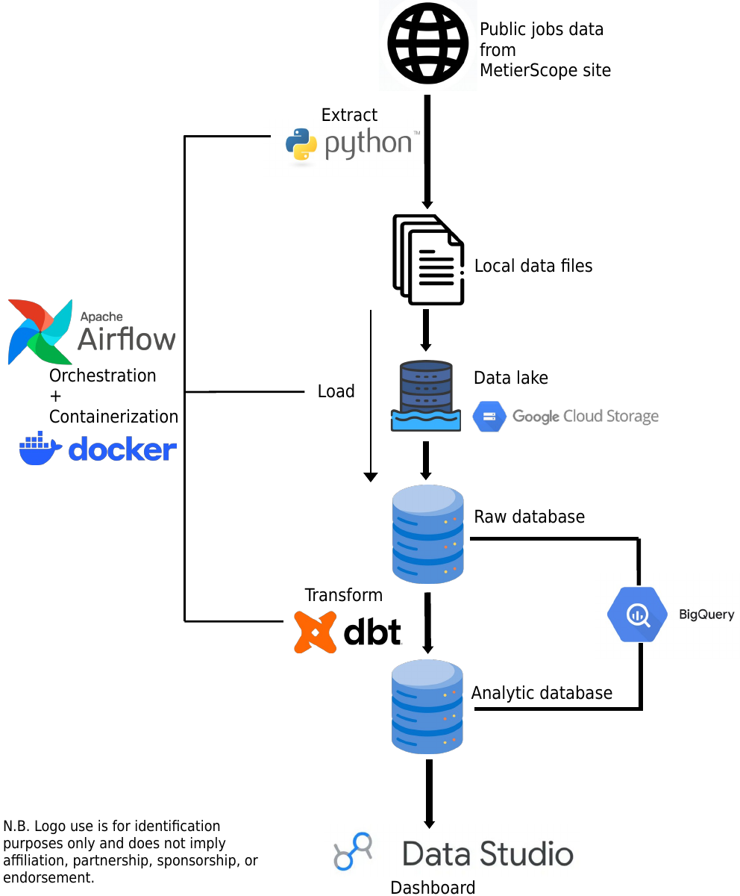

# French job market data project

## Introduction

Did you ever wonder:
- "What are the jobs with the highest number of position offers and the lowest number of applicants ?"
- "Or the opposite, to know which jobs to avoid ?"
- "Same questions but in some specific geographical zones ?"
- "Same questions again but about whole professional areas instead of specific jobs ?"
- "And most importantly: what are the best-paid and worst-paid jobs? And where ?"

For the French job market, this data engineering project lets you answer these questions using the data displayed on the [MetierScope](https://candidat.francetravail.fr/metierscope/) site from France Travail. It consists of an ELT pipeline with:

- Extraction of the readable public data on the France Travail MetierScope site with **Python** code.
- Loading into **Google Cloud Storage** and **BigQuery**.
- Transformation with **dbt** into analytic tables, still in BigQuery.
- The three previous steps **containerized** with **Docker** and **orchestrated** with **Airflow**.
- To make this data useful for analysis, the mart tables are used as a source for a **Google Data Studio interactive dashboard**.

<!--  -->


Feel free to explore and use my dashboard here:

https://datastudio.google.com/reporting/e15e1f03-1387-4edc-8e77-1e4355736b54

Or you can reproduce my project (but without the dashboard, I'm sorry) by cloning this repository and following the instructions in the *Setup for reproducing* section below. For that you'll need a GCP account and Docker and Terraform installed on your machine.

## Dashboard — User Guide

The interactive dashboard allows users to explore the French labour market at different geographical levels — national, regional and departmental — and according to different occupations or professional areas. The available filters make it possible to combine these dimensions to investigate a specific question.

### What are you looking for ?

The dashboard provides numerous views to help users analyze the French labour market from different perspectives. It follows this logical structure: each view displays information about one dimension of the job market (**jobs**, **professional areas** and **territories**), and most of them let you filter by another dimension. For example:

- The first view, "Job Stats (national scale data)", displays national-level job statistics, i.e. it compares the data for multiple jobs.
- The view "Job stats filtered by territory (highest values)" displays statistics about the jobs such as the previous one but with the ability to filter by specific territories.
- The view "Departments stats filtered by job and region name" displays the statistics of departments (i.e it compares the data for multiple departments) with the ability to filter by specific jobs and regions.

So it is recommended to focus on the name of the view to find the information you are looking for, as it usually indicates the main dimension and scope of the data presented.

### Key indicators

**Job offers** and **job seekers** represent the number of job offers and job seekers corresponding to the selected filters.

**Offers/seeker** is the ratio between the number of job offers and the number of job seekers:

> `offers/seeker = job offers / job seekers`

A ratio above 1 means that there are more offers than job seekers within the selected scope; a ratio below 1 indicates the opposite. This ratio should be interpreted together with the absolute volumes: a high ratio based on a very small number of offers does not necessarily represent a large labour market.

**Recruitment difficulty** is an indicator based on data from France Travail and DARES. It is presented on a **1-to-5 scale**:

| Score | Interpretation |
|---:|---|
| **1** | Very easy |
| **2** | Easy |
| **3** | Intermediate |
| **4** | Difficult |
| **5** | Very difficult |

This is an indicator of **recruitment difficulty for companies**, rather than an individual probability of finding a job. Since it measures how hard it is for companies to recruit, a high value means that candidates are scarce relative to demand, so finding a job is, on average, easier within the selected scope.

### Salaries

The *Salary decile* views display the **10th and 90th salary percentiles**. They make it possible to observe the gap between a lower point and a higher point in the salary distribution for the selected occupation and geographical area.

These values should therefore not be interpreted as a minimum and maximum salary: they represent two points of the salary distribution.

### National vs territorial data

You will notice that in some views the job offers and job seekers figures at national level are not equal to those shown elsewhere with exactly the same filters applied.
This is because the views that allow territorial filters show, by default, the aggregated sum (job offers and job seekers) over all departments belonging to the applied territorial filters, whereas the views about national-level data are sourced directly from national-scale data. For example, for a specific job, the view "Job stats (national scale data)" won't give you the same job offers and job seekers values as the view "Job stats filtered by territory (highest)" with no territorial filter active, because the sum of the number of job offers across all departments (the smallest scale possible) is not equal to the number of job offers at national level given by MetierScope.


## Setup for reproducing
0. Prerequisites:
- GCP account: https://cloud.google.com/.
The only resources this project uses are GCS and BigQuery, for a fairly small data volume (around 600 ko for the parquet files, and less than 50 Mo for the datasets in BigQuery), so they won't be very costly after the end of your free trial. **BUT BE VERY CAREFUL TO SECURE YOUR ACCOUNT AND NOT LEAK YOUR CREDENTIALS (especially your GCP JSON authentication key)**.
- Docker: https://www.docker.com/get-started
- Terraform: https://www.terraform.io/downloads.html
1. Clone the repository:
```shell
git clone git@github.com:ArnaudG0649/FTDE_project.git
```
2. Go [here](iac/README.md) to learn how to configure your GCP project, **get the JSON authentication key** and set up the necessary resources with Terraform.
3. In `dags/extract/params.yaml`, there are some important parameters. **You must insert your own GCP project ID for the corresponding parameter (line 14)**. You can change other parameters such as `test_mode`, which lets you download data for only `n` jobs, or `make_csv`, which outputs the extracted data as CSV files in addition to the parquet files.
4. Execute
```shell
docker compose build 
```
once, then each time you want to open the Airflow UI execute
```shell
docker compose up -d
```
Open http://localhost:8080/, enter *airflow* as both username and password, and you can choose between the `extract_load_transform`, `load_transform` and `transform` DAGs in the `dags` tab. `extract_load_transform` is scheduled every month from the 1st of October 2026. I strongly advise extracting France Travail data at a slow pace and setting `test_mode` to `true` as often as possible, because if you try to download too much of their data, this site might stop responding to your requests and blacklist your IP to prevent abuse (don't worry though, the data you want to download is public).


## Data source and responsible use

The data used in this project comes from [MetierScope](https://candidat.francetravail.fr/metierscope/), a public service provided by France Travail (formerly Pôle emploi), the French public employment service. MetierScope provides information and statistics about occupations and the labour market, including indicators such as job offers, applications and salary ranges.

For transparency and reproducibility, the extraction code accesses the following publicly reachable MetierScope endpoints. The identifiers ({domain_code}, {rome_code} and {dept_code}) in the URL patterns below correspond to data keys that the extraction program iterates over:

- https://candidat.francetravail.fr/gw-metierscope/jobs/groupByFirstLetter
- https://candidat.francetravail.fr/gw-metierscope/domains
- https://candidat.francetravail.fr/gw-metierscope/domain/{domain_code}
- https://candidat.francetravail.fr/gw-metierscope/job/{rome_code}
- https://candidat.francetravail.fr/gw-metierscope/job/{rome_code}/labourMarket?territory=FR
- https://candidat.francetravail.fr/gw-metierscope/job/{rome_code}/labourMarket?territory={dept_code}

The extraction code sends standard HTTP GET requests to publicly accessible MetierScope resources. It does not authenticate, access personal accounts, or attempt to access restricted resources.

The dataset collected for this project consists of aggregated labour-market statistics, such as counts of job offers and applications and salary ranges. It does not intentionally collect personal or personally identifiable information about job seekers or employers.

France Travail's current [General Terms of Use](https://www.francetravail.fr/informations/informations-legales-et-conditio/conditions-generales-dutilisatio.html) state, subject to applicable third-party intellectual-property rights, that other content may constitute public information that can be freely reused subject to the Open Licence for the reuse of public information. The French Code on relations between the public and the public administration also provides a framework for the reuse of public information. Reuse remains subject to the applicable legal and licensing conditions.

For this reason, this project follows the following principles:

- The extraction is performed at a conservative rate and volume to avoid placing unnecessary load on the service.
- The extraction should stop if the service becomes unavailable or if an access restriction is encountered.
- No attempt is made to bypass authentication, access controls, rate limits, or other technical restrictions.
- France Travail is credited as the original data source.
- The repository does not redistribute the raw dataset; it provides the extraction, transformation and analysis code for educational and demonstration purposes.

This project is independent of France Travail and is not endorsed by or affiliated with France Travail.

Users intending to reuse or redistribute the data should consult the current [France Travail General Terms of Use](https://www.francetravail.fr/informations/informations-legales-et-conditio/conditions-generales-dutilisatio.html) and the applicable licence and legal requirements before doing so.
